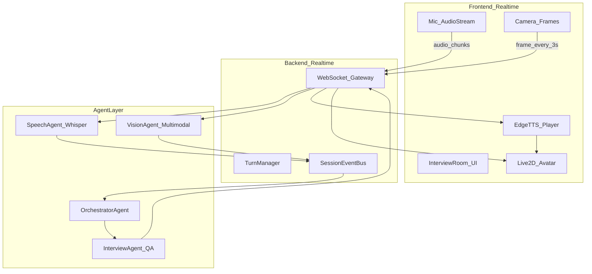

# InterviewOS V2：实时拟真面试系统升级计划

## 现状与核心问题

当前实现（[`frontend/src/app/interview/[id]/page.tsx`](frontend/src/app/interview/[id]/page.tsx)、[`backend/app/services/interview/agent.py`](backend/app/services/interview/agent.py)）本质是 **REST 轮询 + 文本气泡**：

- 语音：Web Speech 只填入输入框，**不自动发送** → 你说「面试官你好」LLM 收不到
- 视频：仅发送时附一帧，无持续状态感知
- 无回合制（AI 说完 → 候选人作答 → 静默追问）
- 无 Avatar、无高质量 TTS、无黄金比例布局
- 单一 Agent，无 Prep 流程，BYOK/档案/简历能力薄弱

**技术难度判断**：可行，难点在 **多模态时序不同步**，不是做不到。推荐用「事件总线 + 状态快照 + 专职 Agent」而非把所有感知塞进一次 LLM 请求。



---

## 同步策略（回答你的核心顾虑）

| 流 | 延迟特征 | 处理方式 |
|----|----------|----------|
| 语音 STT | 1–3s（Whisper 流式/分段） | `SpeechAgent` 输出 **带时间戳的 partial/final 文本**；final 或 VAD 静音 1.2s 触发「候选人回合结束」 |
| 视频状态 | 3–5s 一轮 | `VisionAgent` **不每帧调 LLM**；每 3s 抽帧 → 轻量 CV（人脸/视线/紧张度）+ 每 15s 调一次多模态 LLM 生成 **文字状态摘要** 写入 `SessionContext.vision_summary` |
| 面试问答 | 2–10s | `Orchestrator` 仅在 **候选人回合结束** 或 **静默超时** 时合并最新快照调用 `InterviewAgent` |
| TTS 播放 | 边生成边播 | LLM **SSE 流式** → 句子级切分 → Edge TTS 排队播放 → Live2D 口型跟音频能量/viseme |

**原则**：各 Agent 写 **带 timestamp 的结构化事件** 到 `SessionEventBus`；统筹 Agent 读 **最新快照**（非全量历史），避免「语音比视频快」导致错乱。

静默追问（10s 无回复）：
- 前端 `TurnManager` 计时；超时发 `silence_timeout` 事件
- `Orchestrator` 根据 `personality/strictness` 选择 **引导模板**（宽松）或 **施压追问模板**（严厉）

---

## 目标 UI 布局（黄金比例）

面试间使用 **独立全屏 layout**（隐藏 Sidebar），左右 **2:1**：

```
┌──────────────────────────────────────────────────────────────┐
│ 左侧 (33.3%)              │ 右侧 (66.7%)                    │
│ ┌───────────────────────┐ │ ┌─────────────────────────────┐ │
│ │ 候选人摄像头 (上部)    │ │ │ Live2D 面试官 + 面试场景背景 │ │
│ │ 高:宽 ≈ 1:1.618       │ │ │ 区域高:宽 ≈ 1:1.618         │ │
│ └───────────────────────┘ │ └─────────────────────────────┘ │
│ ┌───────────────────────┐ │ ┌─────────────────────────────┐ │
│ │ 对话气泡 (下部)        │ │ │ 状态栏 + 提纲 + Token 用量   │ │
│ │ 高:宽 ≈ 1:1.618       │ │ │ 可关闭提纲提高难度           │ │
│ └───────────────────────┘ │ └─────────────────────────────┘ │
└──────────────────────────────────────────────────────────────┘
```

实现：[`frontend/src/app/interview/[id]/layout.tsx`](frontend/src/app/interview/[id]/layout.tsx)（新建）+ CSS Grid `grid-cols-[1fr_2fr]` + 子区域 `grid-rows-[1.618fr_1fr]`。

---

## 架构重构（目录）

保持单体部署（非微服务），但 **模块化分层**：

```
backend/app/
├── api/v1/           # REST + WebSocket 路由
├── realtime/         # WS 连接、事件、回合管理
├── agents/
│   ├── orchestrator/ # 统筹：合并快照、决定何时说话
│   ├── interview/    # 出题/追问/阶段（现有 agent 演进）
│   ├── vision/       # 视频状态摘要
│   ├── speech/       # Whisper STT 管道
│   ├── prep/         # 面试准备 ReAct Agent
│   └── report/       # 报告生成
├── services/
│   ├── llm/          # 协议适配器：openai_chat, openai_responses, anthropic
│   ├── stt/          # faster-whisper 本地/API
│   ├── tts/          # edge-tts
│   ├── vision/       # OpenCV + 可选 LLM vision
│   ├── search/       # DuckDuckGo/SearXNG 工具
│   ├── context/      # 上下文压缩、摘要、token 计数
│   └── resume/       # 简历解析/评分/建议
├── models/ schemas/ core/

frontend/src/
├── features/
│   ├── interview-room/  # 布局、回合、静默检测
│   ├── avatar/          # Live2D 封装、口型驱动
│   ├── media/           # 录音、抽帧、WS 客户端
│   ├── prep/            # 准备页 Agent 对话
│   └── report/          # 报告展示增强
├── app/prep/            # 新页面
└── app/interview/[id]/  # 全屏面试
```

---

## 分阶段交付

### Phase 1：实时基础链路（最高优先级，解决「没反应」）

**目标**：语音能自动到达 LLM，AI 能流式回复并朗读。

后端：
- 新增 WebSocket：`/api/v1/ws/interview/{session_id}`
- 集成 **faster-whisper**（本地 CPU/GPU 可配置）于 [`backend/app/services/stt/`](backend/app/services/stt/)
- 集成 **edge-tts** 于 [`backend/app/services/tts/`](backend/app/services/tts/)，返回音频 URL 或 base64
- `LLMClient` 增加 **SSE streaming**（[`backend/app/services/llm/client.py`](backend/app/services/llm/client.py)）
- 事件类型：`audio_chunk`, `stt_partial`, `stt_final`, `user_turn_end`, `assistant_token`, `assistant_done`, `silence_nudge`

前端：
- 新建 [`frontend/src/features/media/useInterviewWS.ts`](frontend/src/features/media/useInterviewWS.ts)：麦克风 PCM 分片上传
- **VAD 静音检测**（`@ricky0123/vad-web` 或能量阈值）：静音 1.2s → 自动 `user_turn_end`
- 回合状态机：`AI_SPEAKING` → `USER_SPEAKING` → `PROCESSING`（禁止重叠）
- 移除「只填输入框不发送」逻辑

验收：开麦说「面试官你好」→ 2–5s 内 AI 文字+语音回复。

---

### Phase 2：面试间 UI + Live2D Avatar

- Live2D Cubism SDK for Web（`pixi.js` + `pixi-live2d-display`）
- 预设 **3 套面试官形象**（专业男/温和女/严厉专家）+ **3 套面试场景背景**（会议室/玻璃隔断/线上面试）
- 口型：TTS 音频 → Web Audio Analyser → Live2D `ParamMouthOpenY`
- 表情：根据 `assistant` 消息情绪标签（LLM 输出 `[emotion:neutral|smile|serious]`）切换 motion
- 可选音色：Edge TTS 中文音色列表（晓晓/云希/云扬等）写入设置页
- 实现黄金比例布局与状态底栏（阶段、token、提纲开关）

资源目录：`frontend/public/avatars/{id}/`、`frontend/public/scenes/{id}.jpg`

---

### Phase 3：多 Agent + 视频状态 + 静默追问

**VisionAgent**（[`backend/app/agents/vision/`](backend/app/agents/vision/)）：
1. 轻量层（每 3s）：MediaPipe Face Mesh 或浏览器 FaceDetector 结果由前端上报 + 后端 OpenCV 校验
2. 语义层（每 15s 或关键回合）：抽帧 → 多模态 LLM → 更新 `vision_summary`（如「候选人频繁低头，语速放缓」）

**OrchestratorAgent**：
- 输入：`stt_final` + `vision_summary` + `phase` + `profile` + `resume` + `silence_event`
- 输出：给 `InterviewAgent` 的增强 prompt + 是否触发 nudge

**静默追问**：
- 10s 无 `stt_partial` 且处于 `USER_SPEAKING` → Orchestrator 生成引导/施压语句
- 严厉度映射沿用 [`workflows.py`](backend/app/services/interview/workflows.py) 的 `strictness`

---

### Phase 4：个人档案 + 简历增强

**Profile 扩展**（[`models`](backend/app/models/__init__.py)、[`profile` API](backend/app/api/profile.py)）：
- 新增：gender, identity（学生/在职/待业）, school, major, graduation_year, work_years, current_company, expected_salary_range, self_intro
- 面试 Agent system prompt 注入完整档案

**Resume 增强**（[`resume` API](backend/app/api/resume.py)）：
- 多简历：`is_active` 标记「投递简历」
- 新 API：`POST /resume/{id}/analyze` → 返回简历评分、改进建议、**预测面试高频问题**
- 面试配置页只允许选择 active 或指定简历

---

### Phase 5：面试准备页（ReAct Agent）

新页面 [`frontend/src/app/prep/page.tsx`](frontend/src/app/prep/page.tsx) + 后端 [`backend/app/agents/prep/`](backend/app/agents/prep/)

能力：
- 基于选定简历 + 目标岗位/公司的 **对话式辅导**
- ReAct 循环：Thought → Action（`web_search`, `search_company_interview`, `quiz_user`, `summarize_resume`）→ Observation
- 工具：DuckDuckGo（无需 API Key）+ 内置企业知识库
- **上下文管理**：超过 60% context window 时自动摘要压缩（[`services/context/`](backend/app/services/context/)）
- 主动反问：「你在这个项目里的具体贡献是？」「算法题薄弱要不要来一道？」
- 可直接出题：选择题/简答题，用户作答后 Agent 点评

---

### Phase 6：BYOK 设置完善

扩展 [`LLMSettings`](backend/app/models/__init__.py) + 设置页：

| 字段 | 说明 |
|------|------|
| api_base | 已有 |
| api_key | 已有 |
| protocol | `openai_chat` / `openai_responses` / `anthropic_messages` |
| model | 已有 |
| context_window | 已有，接入实际 token 计数 |
| max_tokens | 已有 |
| reasoning_effort | low/medium/high（StepFun 等） |
| supports_vision | 自动探测 + 手动覆盖 |
| supports_audio | 预留；不支持时走 Whisper 文本链路 |
| stt_model | Whisper 模型大小 tiny/base/small |
| tts_voice | Edge TTS voice id |

**非多模态 LLM 降级路径**：VisionAgent 始终产出 **文字状态摘要** 注入 prompt，不依赖 vision API。

---

### Phase 7：面试报告增强

扩展 [`InterviewReport`](backend/app/schemas/__init__.py)：

- 总体评分 + 分项（技术/表达/项目/问题解决/临场状态）
- 优点 / 缺点 / 改进建议（**简历修改建议** + **面试表现建议** 分开）
- 阶段复盘、静默/紧张时刻记录（来自 VisionAgent 事件）
- 预测下一轮训练计划（已有 growth，增强关联）

报告页 [`frontend/src/app/report/[id]/page.tsx`](frontend/src/app/report/[id]/page.tsx) 增加雷达图与可打印布局。

---

## 关键依赖（新增）

```txt
# backend
faster-whisper>=1.0.0
edge-tts>=6.1.0
sse-starlette>=2.0.0
websockets>=12.0
opencv-python-headless>=4.9.0
duckduckgo-search>=6.0.0

# frontend
pixi.js@7.x
pixi-live2d-display
@ricky0123/vad-web
```

---

## Git 分支策略

| 分支 | 内容 |
|------|------|
| `main` | 稳定版 |
| `feat/v2-realtime-core` | Phase 1 WS + Whisper + 自动发送 |
| `feat/v2-interview-ui` | Phase 2 Live2D + 布局 |
| `feat/v2-multi-agent` | Phase 3 |
| `feat/v2-prep-agent` | Phase 5 |
| `feat/v2-profile-resume-byok` | Phase 4 + 6 |
| `feat/v2-report` | Phase 7 |

每完成一个 Phase commit 一次，大 Phase 合并前跑通 E2E。

---

## 风险与对策

| 风险 | 对策 |
|------|------|
| Whisper 本地慢 | 默认 `base` 模型；可选云端 Whisper API BYOK |
| Live2D 模型版权 | 使用官方免费示例模型 + 文档说明替换方式 |
| LLM 流式 + TTS 延迟 | 句子级触发 TTS，不等待全文 |
| 多 Agent token 成本 | Vision 低频摘要；上下文压缩；提纲可关 |
| 浏览器麦克风权限 | 面试页进入时引导授权；降级为手动发送 |

---

## 建议实施顺序

1. **Phase 1**（解决你说的完全没反应）— 约 2–3 天
2. **Phase 2 UI + Live2D** — 约 3–4 天
3. **Phase 3 多 Agent + 静默追问** — 约 2–3 天
4. **Phase 4/6 档案简历 BYOK** — 约 2 天
5. **Phase 5 准备页** — 约 3 天
6. **Phase 7 报告** — 约 1 天

总计约 **2–3 周** 可交付完整 V2（单人全栈节奏）。
