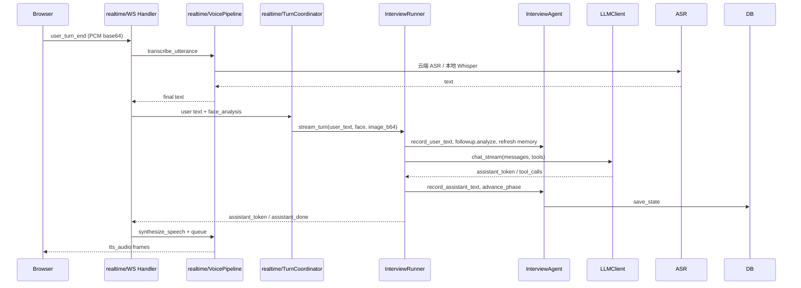

# 系统架构全景

InterviewOS 采用前后端分离架构：前端为 Next.js 15 单页应用，后端为 FastAPI + Uvicorn 的 Python 服务，数据层以本地 SQLite 和 Chroma 为主，外部依赖为 BYOK（Bring Your Own Key）的 LLM / ASR / TTS 服务。

## 分层视图

```mermaid
flowchart TB
    subgraph Browser["浏览器 / Next.js 15"]
        P[页面：landing/profile/resume/prep/interview/history/growth/report/settings]
        C[共享组件与 effects]
        M[features/media: useInterviewWS / useAudioRecorder / useTTSPlayer]
        A[features/avatar: InterviewerAvatar / TalkingHeadAvatar]
    end

    subgraph Backend["FastAPI 后端"]
        API[api/v1 REST + WebSocket 路由]
        RT[realtime: WS 协议网关]
        SRV[services: 面试/LLM/STT/TTS/RAG/简历/成长]
        AGT[agents: orchestrator / vision / prep]
        CORE[core: 安全/日志/限流/迁移/加密]
        MDL[models: SQLAlchemy ORM]
        SCH[schemas: Pydantic 契约]
    end

    subgraph AI["BYOK AI 适配器"]
        LLM[思考 LLM]
        ASR[多厂商 ASR + 本地 Whisper]
        TTS[Edge TTS / MiniMax Speech]
        RAG[Chroma / StepFun 向量检索]
        WS[DuckDuckGo 搜索]
        GH[GitHub REST 工具]
    end

    subgraph Data["本地数据"]
        DB[(SQLite ./data/interviewos.db)]
        CH[(Chroma collections)]
        UP[uploads/ 简历文件]
        SL[system_learning.json]
    end

    Browser -->|fetch /api/v1/*| API
    Browser -->|WS /api/v1/ws/interview/{id}| RT
    API --> SRV --> CORE --> MDL/SCH
    RT --> SRV --> AGT
    SRV --> LLM
    SRV --> ASR
    SRV --> TTS
    SRV --> RAG --> CH
    SRV --> WS
    SRV --> GH
    SRV --> DB
    MDL --> DB
```

## 模块依赖收敛

```
app/api ──► app/services ──► app/core (security/secrets/logging/ratelimit/migrate)
                          ├──► app/models
                          └──► app/schemas
```

- `app/core` 不依赖 `app/api` 或 `app/services`，可独立单测。
- `app/services/*` 不依赖 `app/api/*`，避免循环导入。
- `app/realtime` 是特殊的网关层：只编排 `app/services`，自身不写业务规则。

## 实时面试数据流



## 关键运行时边界

| 关注点 | 实现位置 | 约束 |
|---|---|---|
| 单会话 WS 连接互斥 | `app/realtime/session_registry.py` | 新连接踢旧连接 |
| WS 心跳 | `app/realtime/connection_lifecycle.py` | 30s server_ping，3 次未 pong 关闭 |
| 上下文压缩 | `app/services/context/manager.py` | 30% context_window 阈值触发摘要 |
| 工具轮上限 | `app/config.py` + `app/services/interview/tools.py` | `INTERVIEW_MAX_TOOL_ROUNDS` 默认 3 |
| 文件上传上限 | `app/core/constants.py` + `app/api/resume.py` | 10 MB + 魔数嗅探 + 路径越界校验 |
| API Key 加密 | `app/core/secrets.py` | AES-256-GCM，格式 `enc:v2:...` |
| SSRF 防御 | `app/core/security.py` | 多 A 记录遍历、DNS pin、端口白名单 |
| 限流 | `app/core/ratelimit.py` | 进程内滑动窗口，普通接口默认 60/分钟，LLM 接口默认 10/分钟 |

## 扩展点

| 需求 | 修改点 | 必读 |
|---|---|---|
| 新增 ASR/TTS 供应商 | `app/services/stt/` 或 `app/services/tts/` | [stt](../backend/services/stt.md), [tts](../backend/services/tts.md) |
| 新增面试工作流 | `app/services/interview/workflows.py` + `app/core/constants.py` | [workflows](../backend/services/interview/workflows.md) |
| 新增 RAG 后端 | 实现 `RAGBackend` 协议 + `factory.py` 注册 | [rag/overview](../backend/services/rag/overview.md) |
| 新增 GitHub/外部工具 | `app/services/github/tools.py` + `app/services/interview/tools.py` | [github](../backend/services/github.md), [interview tools](../backend/services/interview/tools.md) |
| 新增前端页面 | `frontend/src/app/<route>/page.tsx` + `src/config/nav.ts` + `src/lib/api.ts` | [frontend overview](../frontend/overview.md) |
| 新增前端事件类型 | `frontend/src/types/index.ts` + `app/core/constants.py` | [api-client](../frontend/api-client.md), [constants](../backend/constants.md) |

## 相关页面

- [快速开始](../quickstart.md)
- [后端入口](../backend/main.md)
- [安全模型](../security.md)
- [前端概览](../frontend/overview.md)
- [面试服务概览](../backend/services/interview/overview.md)
- [实时 WebSocket 概览](../backend/realtime/overview.md)
