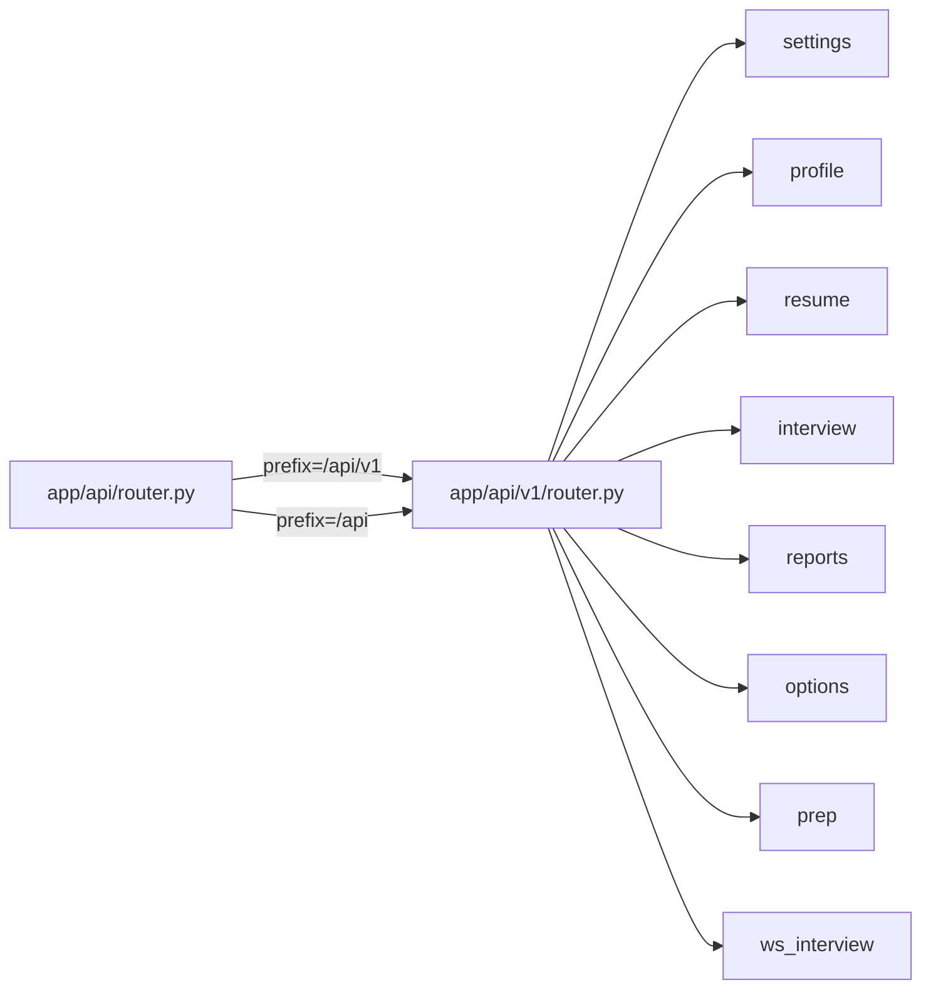

# API 路由与 v1/legacy 别名

## 路由聚合结构

- `app/api/router.py` 包含 `api_router`。
- `app/api/v1/router.py` 定义 `v1_router`，聚合所有子路由，但自身不挂 prefix。
- `api_router.include_router(v1_router, prefix="/api/v1")` 暴露权威路径 `/api/v1/*`。
- `api_router.include_router(v1_router, prefix="/api")` 暴露兼容别名 `/api/*`。

## 权威路径 vs 兼容别名

- 新客户端应使用 `/api/v1/*`。
- `/api/*` 在 3 个月内保留兼容，计划在 2026-10-01 后逐步移除。
- `tests/test_api_v1_paths.py` 验证同一端点在两条路径下均存在且响应一致。

## v1 子路由来源

| 子路由 | 文件 | 挂载前缀 |
|---|---|---|
| settings | `app/api/settings.py` | `/settings` |
| profile | `app/api/profile.py` | `/profile` |
| resume | `app/api/resume.py` | `/resume` |
| interview | `app/api/interview.py` | `/interview` |
| reports | `app/api/reports.py` | `/reports` |
| options | `app/api/options.py` | `/options` |
| prep | `app/api/v1/prep.py` | `/prep` |
| ws_interview | `app/api/v1/ws_interview.py` | 无（直接 `/api/v1/ws/interview/{id}`） |

## 与前端对齐

前端 `src/lib/api.ts` 已迁移到 `/api/v1/*`（或经 `next.config.js` 代理）。移除后端 `/api` 别名前，必须先更新前端并验证 `test_api_v1_paths.py` 仅校验 `/api/v1` 路径。

## 相关页面

- [后端入口](../main.md)
- [settings 端点](./settings.md)
- [profile 端点](./profile.md)
- [resume 端点](./resume.md)
- [interview 端点](./interview.md)
- [reports 端点](./reports.md)
- [options 端点](./options.md)
- [prep 端点](./prep.md)
- [websocket 端点](./websocket.md)
