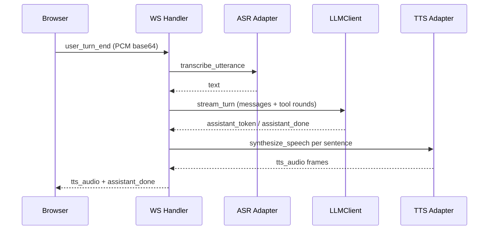

# 实时面试 WebSocket 端点

## 路径

```
ws://{host}/api/v1/ws/interview/{session_id}
```

由 `app/api/v1/ws_interview.py` 注册，挂载在 `app/api/v1/router.py` 下。

## 握手与令牌

WebSocket 握手时从以下位置提取会话能力令牌：

1. Cookie `interviewos_iv_{session_id}`（HttpOnly，优先）
2. `Sec-WebSocket-Protocol: interviewos.<token>`
3. query `?token=`（仅非生产）

令牌校验失败返回 403。

## 单连接互斥

`app/realtime/session_registry.py` 保证同一 `session_id` 同时仅有一条活跃 WebSocket 连接。新连接建立时，旧连接会被标记为 `superseded` 并优雅关闭。测试 `tests/test_session_ws_mutex.py` 覆盖此行为。

## 消息协议

所有消息为 JSON，通过 `type` 字段区分。完整事件列表见 `app/core/constants.py`（`WSServerEvent`、`WSClientEvent`）与 `frontend/src/types/index.ts`（`ServerEvent`、`ClientEvent`）。

主要客户端事件：

- `user_text`：文本消息
- `user_turn_end`：音频/文本回合结束（base64 PCM 16k）
- `stt_text`：STT 中间结果
- `silence_timeout`：静默超时
- `request_hint`：请求参考提纲
- `request_finish`：请求结束面试
- `vision_update`：人脸分析更新
- `pong`：心跳回复

主要服务端事件：

- `turn_state`：IDLE / USER_SPEAKING / PROCESSING / AI_SPEAKING
- `stt_partial` / `stt_final`：转写结果
- `assistant_token` / `assistant_done`：LLM 流式输出
- `tts_audio`：base64 MP3 音频帧
- `silence_nudge`：静默追问提示
- `reference_hint_loading` / `reference_hint`：参考提纲
- `phase_changed`：阶段切换
- `interview_complete`：面试结束，附带 report_id
- `server_ping`：心跳

## 三处理器实时流



## 相关页面

- [WS Handler](../realtime/ws-handler.md)
- [连接生命周期](../realtime/connection-lifecycle.md)
- [话轮协调](../realtime/turn-coordinator.md)
- [语音管道](../realtime/voice-pipeline.md)
- [事件定义](../realtime/events.md)
- [会话注册表](../realtime/session-registry.md)
- [前端 media pipeline](../../frontend/media-pipeline.md)
