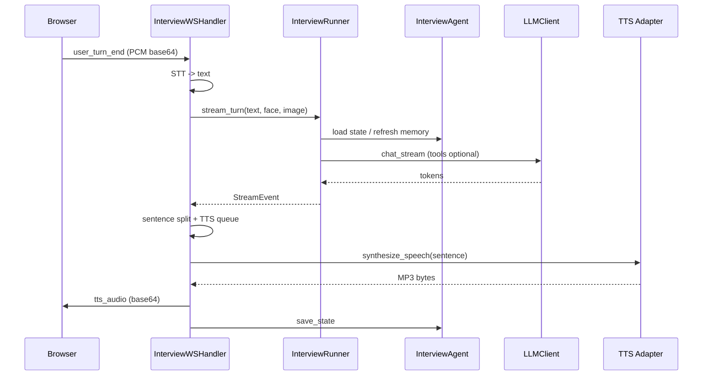

# 实时 WebSocket 层概览

`app/realtime/` 是 WebSocket 面试的协议网关层。它只负责连接生命周期、消息分发、语音管道、提示服务与后台报告调度，**不承载业务规则**。业务规则集中在 `app/services/interview/`。

## 设计原则

- **不直接调用 LLM**：所有 AI 行为通过 `InterviewRunner` 委托给 `app/services/interview/`。
- **不持久化业务状态**：状态保存由 `InterviewAgent.save_state()` 完成。
- **组合优于继承**：`InterviewWSHandler` 通过多个 mixin 组合能力，每个 mixin 只负责一个运行时关注点。
- **测试友好**：大量内部符号通过 `__all__` re-export，便于测试 patch。

## Mixin 职责

| Mixin | 职责 |
|---|---|
| [ConnectionLifecycleMixin](./connection-lifecycle.md) | 握手、心跳、单连接互斥、关闭 |
| [TurnCoordinatorMixin](./turn-coordinator.md) | 候选人回合调度、状态机 |
| [TurnControlMixin](./turn-control.md) | 打断、结束、中断统计 |
| [TurnStreamingMixin](./turn-streaming.md) | runner 事件流式消费 + TTS 推送 |
| [VoicePipelineMixin](./voice-pipeline.md) | STT、TTS 队列、音频缓冲、回声抑制 |
| [HintServiceMixin](./hint-service.md) | 参考提纲请求 |
| [ReportSchedulerMixin](./report-scheduler.md) | 后台报告生成 |

## 与 API 层关系

`app/api/v1/ws_interview.py` 注册 WebSocket 路由：

```python
websocket("/api/v1/ws/interview/{session_id}")
```

收到连接请求后，创建 `InterviewWSHandler` 并调用其生命周期方法。

## 数据流



## 相关页面

- [WS 门面](./ws-handler.md)
- [API WebSocket 端点](../api/websocket.md)
- [InterviewRunner](../services/interview/runner.md)
- [InterviewAgent](../services/interview/agent.md)
- [前端媒体管道](../../frontend/media-pipeline.md)
