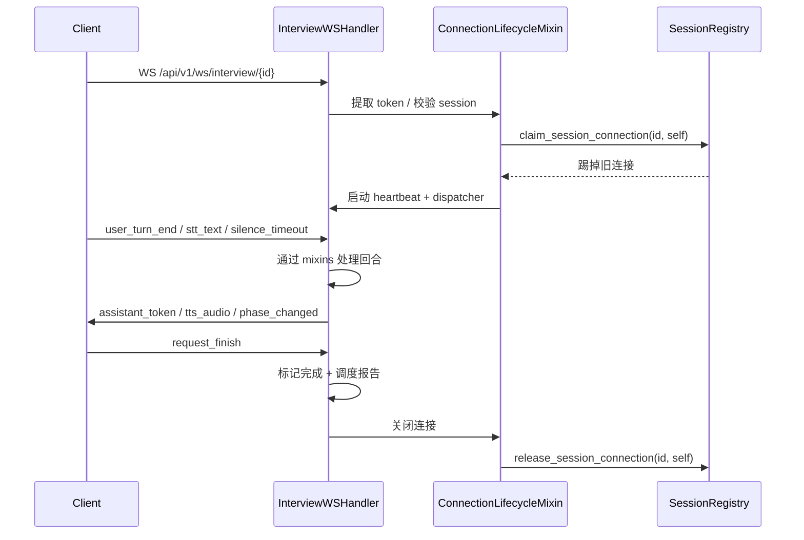

# WebSocket 会话处理器（门面）

`app/realtime/ws_handler.py` 是实时面试 WebSocket 的**组合根**。它本身不包含业务规则，只负责组合各个 mixin、维护状态对象、提供测试兼容的 re-export。

## 关键符号

- `class InterviewWSHandler(ConnectionLifecycleMixin, TurnCoordinatorMixin, VoicePipelineMixin, HintServiceMixin, ReportSchedulerMixin)`
- `_spawn(coro)`：创建后台任务并登记，完成后自动清理
- `_cancel_bg_tasks()`：取消并等待所有后台任务
- `_load_session(db)`：加载当前会话

## 状态对象

每个 handler 实例持有：

| 字段 | 说明 |
|---|---|
| `ws` | FastAPI `WebSocket` 对象 |
| `session_id` | 当前面试会话 ID |
| `_client_access_token` | 握手时提取的能力令牌 |
| `turn_state` | `TurnState`（IDLE / AI_SPEAKING / USER_SPEAKING / PROCESSING） |
| `agent`, `llm`, `runner` | 延迟加载的 InterviewAgent、LLMClient、InterviewRunner |
| `audio_buffer` | 累积的 base64 音频块 |
| `_audio_buffer_bytes` | 缓冲字节计数，上限 5 MB |
| `_stt_creds`, `_tts_creds` | 当前配置的 ASR/TTS 凭证 |
| `_tts_queue` | 句子级 TTS 播放队列 |
| `_bg_tasks` | 后台任务集合 |
| `_report_task` | 报告生成后台任务 |

## Mixin 职责

| Mixin | 文件 | 职责 |
|---|---|---|
| `ConnectionLifecycleMixin` | `connection_lifecycle.py` | 握手、心跳、单连接互斥、生命周期 |
| `TurnCoordinatorMixin` | `turn_coordinator.py` | 候选人回合调度、状态流转 |
| `TurnControlMixin` | `turn_control.py` | 打断、结束、统计写入 |
| `TurnStreamingMixin` | `turn_streaming.py` | runner 事件流式消费 + TTS 推送 |
| `VoicePipelineMixin` | `voice_pipeline.py` | STT 选择、TTS 队列、音频缓冲 |
| `HintServiceMixin` | `hint_service.py` | 参考提纲请求 |
| `ReportSchedulerMixin` | `report_scheduler.py` | 后台报告生成 |

## 测试兼容 re-export

`__all__` 暴露多个内部符号供测试 patch：

- `_SentenceTTSQueue`, `_AUDIO_BUFFER_MAX_BYTES`, `_IMAGE_BASE64_MAX_LEN`
- `_active_handlers`, `claim_session_connection`, `release_session_connection`
- `transcribe_utterance`, `_pick_stt_text`, `_should_skip_whisper`, `_is_echo_of_assistant`, `_latin_letter_ratio`, `_normalize_echo_text`

## 生命周期

## 相关页面

- [连接生命周期](./connection-lifecycle.md)
- [回合调度](./turn-coordinator.md)
- [打断控制](./turn-control.md)
- [流式处理](./turn-streaming.md)
- [语音管道](./voice-pipeline.md)
- [参考提示](./hint-service.md)
- [报告调度](./report-scheduler.md)
- [会话注册表](./session-registry.md)
- [API WebSocket 端点](../api/websocket.md)
