# 面试领域服务概览

`app/services/interview/` 是实现面试流程的核心业务层。所有 HTTP 与 WebSocket 路径最终都通过 `InterviewRunner` 与 `InterviewAgent` 驱动。

## 模块职责地图

| 模块 | 文件 | 职责 |
|---|---|---|
| Agent | `agent.py` | 会话状态机：消息历史、阶段索引、结构化记忆、状态持久化 |
| Runner | `runner.py` | 回合执行器 façade：对外暴露 `stream_opening/turn/closing` |
| StreamingConsumer | `streaming_consumer.py` | 三个流式入口：开场、回合、结束；token 发射、工具循环、状态保存 |
| PromptAssembler | `prompt_assembler.py` | 纯消息构造：用户内容、API messages、上下文压缩 |
| ToolRoundRunner | `tool_round_runner.py` | OpenAI function calling 工具轮执行 |
| tools | `tools.py` | 工具定义与执行（GitHub、搜索、公司、简历） |
| agent_prompts | `agent_prompts.py` | system prompt 构建 |
| agent_text | `agent_text.py` | 标记/思考块剥离、情绪检测、ThinkStreamFilter |
| followup | `followup.py` | 追问信号分析 |
| report | `report.py` | 报告生成与持久化 |
| workflows | `workflows.py` | 阶段元数据唯一来源 |
| events | `events.py` | 流式事件类型（TOKEN/TURN_COMPLETE/ERROR） |

## 一次完整面试回合

```mermaid
flowchart LR
    A[InterviewRunner.stream_turn] --> B[记录 user_text]
    B --> C[followup.analyze]
    C --> D{是否需要追问?}
    D -->|是| E[注入追问 probe]
    D -->|否| F[refresh_system_memory]
    E --> F
    F --> G[可选 RAG 检索]
    G --> H[构建 api_messages]
    H --> I[ToolRoundRunner.run_tool_rounds]
    I --> J[LLMClient.chat_stream]
    J --> K[发射 assistant_token]
    K --> L[检测 PHASE_COMPLETE/INTERVIEW_COMPLETE]
    L --> M[advance_phase_if_needed]
    M --> N[save_state]
```

## 与 WebSocket 层关系

`app/realtime/ws_handler.py` 的 `InterviewWSHandler` 持有 `InterviewRunner` 实例，通过 `runner.stream_turn` 与 `stream_opening` 获取流式事件，再转换为 WS 帧下发。

## 关键不变式

- `workflows.py` 是阶段元数据唯一来源；`InterviewPhaseId` 仅约束 id。
- 所有状态变更最终由 `InterviewAgent.save_state(db)` 落库。
- `agent_state` 结构化字段（`asked_questions`、`weak_points`、`github_findings`、`tool_trace`）在上下文压缩后仍可被读取。
- `INTERVIEW_COMPLETE` 与 `PHASE_COMPLETE` 标记由 LLM 输出，经 `agent_text` 剥离后再展示给候选人。

## 聚焦测试

- `tests/test_runner.py`：完整回合流程、工具循环、阶段切换、结束。
- `tests/test_followup.py`：追问信号分类与 probe 注入。
- `tests/test_agent_prompts.py`：system prompt 构建。
- `tests/test_phase_ssot.py`：阶段单一真相源。
- `tests/test_context_compress.py`：上下文压缩阈值。

## 相关页面

- [InterviewAgent](./agent.md)
- [InterviewRunner](./runner.md)
- [StreamingConsumer](./streaming.md)
- [Prompts](./prompts.md)
- [Followup](./followup.md)
- [Tools](./tools.md)
- [Report](./report.md)
- [Workflows](./workflows.md)
