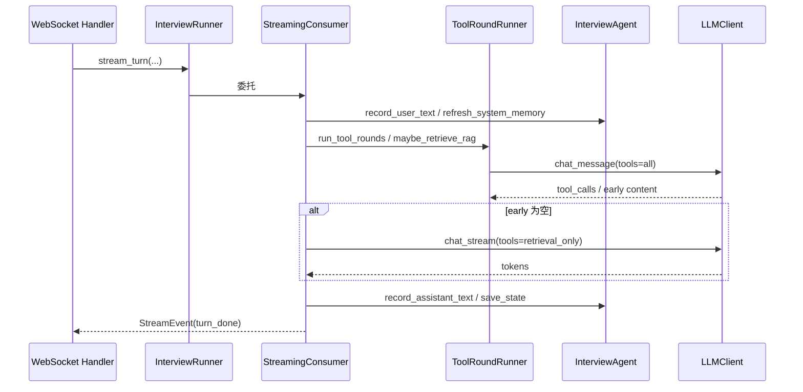

# 流式消费者

`StreamingConsumer` 是 `InterviewRunner` 内部真正的执行者。它把一次面试回合拆分为可观察的 `StreamEvent` 流。事件类型定义在 `app/services/interview/events.py`。

## 关键符号

- `class StreamingConsumer`（`streaming_consumer.py`）
- `class StreamEvent` / `EventKind`（`events.py`）
- `stream_opening(db)` / `stream_turn(user_text, db, ...)` / `stream_closing(db)`

## 事件模型

```python
class EventKind(str, Enum):
    TOKEN = "token"             # 流式 token
    TURN_COMPLETE = "turn_done" # 单个回合完成
    ERROR = "error"             # 异常

@dataclass(frozen=True)
class StreamEvent:
    kind: EventKind
    token: str = ""
    content: str = ""           # 仅 TURN_COMPLETE
    phase_id: str = ""
    is_complete: bool = False
    phase_changed: bool = False
    emotion: str = "neutral"
    error: str = ""
```

工厂方法：`StreamEvent.make_token` / `make_turn_done` / `make_error`。

## stream_opening 流程

1. `agent.reset_messages()`，`build_opening_prompt(db)` 重建 system prompt。
2. 按 `context_window` 调用 `compress_messages`。
3. 追加 user 触发消息：`面试开始，请按照当前阶段开始提问。`
4. `ToolRoundRunner.run_tool_rounds(..., temperature=0.8)`。
5. 若工具首轮直接返回 `early` content，整段作为 token 产出；否则 `llm.chat_stream(..., tools=retrieval_only)` 流式生成。
6. `record_assistant_text`、`set_questions_in_phase(1)`、`mark_active`、`save_state`。
7. 产出 `turn_done`（`strip_markers` + `detect_emotion`）。

## stream_turn 流程

1. 若 session 已 `completed`，返回 error。
2. `record_user_text(user_text)`。
3. `followup.analyze`：需要追问时注入 system probe，并写入 `agent_state["followup_clues"]` / `note_weak_point`。
4. `refresh_system_memory()`。
5. `tools.maybe_retrieve_rag(query=last_question + user_text)`；命中则追加 system 消息（StepFun 后端此处返回 `None`，改由 chat tools 注入 retrieval）。
6. `PromptAssembler.build_user_content` 重组含面部分析的 user 消息；必要时附加 `image_b64`。
7. `build_api_messages` + 上下文压缩。
8. `run_tool_rounds(..., temperature=0.75)`。
9. 流式 `chat_stream`（仅 retrieval tools，避免再次 function calling）。
10. `record_assistant_text` → 检测 `[INTERVIEW_COMPLETE]` / 阶段推进 → `save_state` → `turn_done`。

## stream_closing 流程

候选人主动结束：按 `session.personality` 选择收尾语气，跳到 summary（或最后）阶段，流式生成口头小结，确保以 `[INTERVIEW_COMPLETE]` 结尾，`mark_completed` 后产出 `turn_done(is_complete=True)`。

## 工具与流式分离

| 阶段 | LLM API | tools |
|---|---|---|
| 工具循环 | 非流式 `chat_message` | function tools +（可选）StepFun retrieval |
| 最终播报 | 流式 `chat_stream` | 仅 retrieval（`include_function_tools=False`） |

轮次上限：`min(settings.interview_max_tool_rounds, MAX_TOOL_ROUNDS)`，默认 3。

## 与上下层关系



## 聚焦测试

- `tests/test_runner.py`：开场、回合、工具、阶段切换、完成路径。
- `tests/test_followup.py`：追问注入。
- `tests/test_rag.py` / `tests/test_rag_backends.py`：RAG 注入。

## 相关页面

- [InterviewRunner](./runner.md)
- [Tools / ToolRoundRunner](./tools.md)
- [Prompts](./prompts.md)
- [Followup](./followup.md)
- [面试服务概览](./overview.md)
- [RAG 概览](../rag/overview.md)
