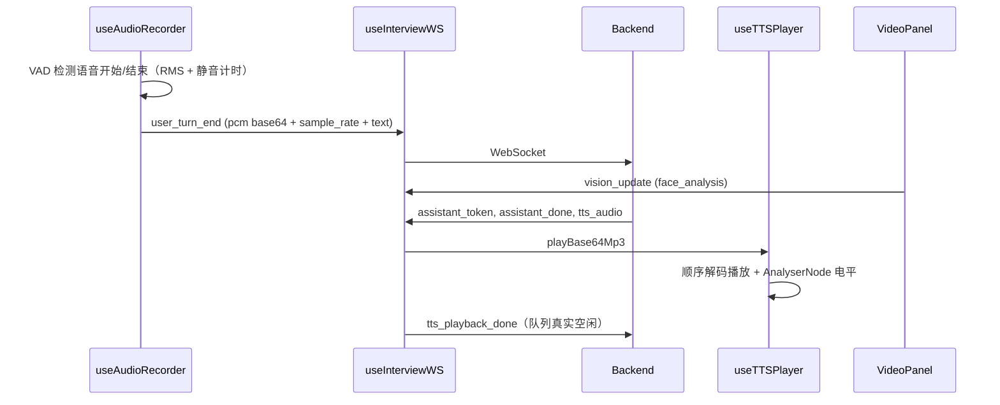

# 媒体管道

实时面试页面通过多个 hooks 和组件协同工作：

- `useInterviewWS`：WebSocket 连接、重连、事件分发、话轮状态
- `useAudioRecorder`：麦克风采集、VAD、静音提交、打断检测、PCM 编码
- `useTTSPlayer`：MP3 队列播放、音频解锁、唇同步音频电平
- `VideoPanel`：摄像头捕获、FaceDetector 面部分析

## 流程概览

## useInterviewWS

`src/features/media/useInterviewWS.ts`：

- 连接 `ws://${WS_BASE}/api/v1/ws/interview/${sessionId}`；凭证由浏览器随同源 Cookie 自动携带，不再经子协议传递令牌。
- 使用 `generationRef` + socket 实例比对防止 React Strict Mode / cleanup 竞态导致「旧 onclose 误重连 → 服务端踢旧 → 闪屏循环」。
- 主动关闭（close code 1000，reason 为 `client_cancel` / `replace` / `stale`）不触发重连。
- 重连：指数退避 `min(1000 * 2 ** (attempt-1), 8000)`，默认最多 5 次（`options.maxRetries` 可覆盖）；耗尽后 `connectionState` 置 `failed`，转为后台 20 秒长间隔重试。
- 心跳：收到 `server_ping` 自动回 `pong`（携带 `t`），不派发给业务 handler。
- `turn_state` 事件同步为内部 `turnState`；其余事件按 `handlersRef` 分发到 typed handler；畸形帧静默忽略。

返回 API：`connected`、`everConnected`（是否曾连上过，用于区分首次连接与短暂断线）、`turnState`、`reconnectAttempt`、`connectionState`（`connecting | open | reconnecting | failed`）、`send(payload)`、`on(type, handler)`、`cancel()`、`retryNow()`。

## useAudioRecorder

`src/features/media/useAudioRecorder.ts`：

- `getUserMedia({ audio: { echoCancellation, noiseSuppression, autoGainControl } })`；`AudioContext({ sampleRate: 16000 })` + `ScriptProcessorNode(4096, 1, 1)` 逐块 RMS 能量检测。
- 采集路径：float32 → Int16 PCM → 重采样到 16 kHz → base64（`encodeBase64`），回调携带 `sampleRate=16000`。
- 静音提交判定：需同时满足「块数 > MIN_CHUNKS_BEFORE_SILENCE(2)」「语音块 ≥ MIN_SPEECH_CHUNKS(5) 或文本 ≥ MIN_TEXT_CHARS(8)」；interim 仍在跳动（600ms 内更新过）禁止提交。
- 快路径：近期有 final 且句末标点或 interim 已清空稳定 400ms（`FINAL_SETTLE_MS`）→ 静音阈值放宽为 `SILENCE_FAST_MS=1000`；否则 `SILENCE_TRIGGER_MS=1800`。
- 语言切换：`latinLetterRatio` 按**整段文本**的拉丁字母占比在 `zh-CN` / `en-US` 间切换浏览器 `SpeechRecognition`。
- AI 发言期（`captureEnabled=false`）：只把 PCM 写入 2.5s 环形缓冲（`RING_BUFFER_SEC`）并做打断能量检测——RMS ≥ `BARGE_RMS_THRESHOLD(0.028)` 且持续 `BARGE_SUSTAIN_MS(700)`、距上次触发 ≥1200ms 时回调 `onBargeCandidate`；此模式下不录音、不开 ASR、不提交。
- 采集武装延时：普通恢复 `CAPTURE_ARM_DELAY_MS=450`（避开扬声器余响）；打断后 `CAPTURE_ARM_AFTER_BARGE_MS=200`，且把环形缓冲拷为下一轮采集种子（`seedCaptureFromRing`）。
- 内存保护：录音 chunk 总量超过 `MAX_CHUNKS_BYTES(30MB)` 时丢弃最早 chunk。

关键常量：

| 常量 | 值 | 含义 |
|---|---|---|
| `TARGET_SAMPLE_RATE` | 16000 | 采集/重采样目标采样率 |
| `SILENCE_RMS_THRESHOLD` | 0.006 | 低于此 RMS 视为静音 |
| `SILENCE_TRIGGER_MS` | 1800 | 默认静音提交时长 |
| `SILENCE_FAST_MS` | 1000 | 快路径静音时长 |
| `BARGE_RMS_THRESHOLD` | 0.028 | 打断专用高能量阈值 |
| `BARGE_SUSTAIN_MS` | 700 | 高能量持续时长才触发打断 |
| `RING_BUFFER_SEC` | 2.5 | AI 期环形缓冲时长 |
| `MAX_CHUNKS_BYTES` | 30 MB | 录音 chunk 上限 |

返回：`isRecording`、`partialText`、`micError`、`flush()`（立即提交当前缓冲）、`clearCaptureBuffers()`、`seedCaptureFromRing()`、`stop()`。

## useTTSPlayer

`src/features/media/useTTSPlayer.ts`：

- promise 链串行队列：`playBase64Mp3` 依次排队播放 `data:audio/mpeg;base64,...`。
- `unlockAudio()`：必须在用户手势中调用——resume AudioContext 后播放 20ms 静音振荡器探针验证自动播放许可；失败置 `audioUnlocked=false` 并回调 `onPlaybackBlocked(true)`。
- 未解锁时 `playBase64Mp3` 只进 `heldQueueRef`，不播放、**不假报** `tts_playback_done`；解锁后 `flushHeldQueue()` 重放。已解锁但播放失败也进 held 并回调 blocked。
- 电平：`AnalyserNode`（fftSize=256）经 `requestAnimationFrame` 循环读取时域 RMS，电平 = `min(1, rms * 4)`，驱动头像唇同步（`setOnAudioLevel`）。
- 空闲回报：`_notifyIfIdle` 仅在队列与当前播放真正为空时回调 `onPlaybackDone`（页面转发 `tts_playback_done` 给后端开麦）；「未解锁且仅有 held」不回报，避免无声假 done。
- `stop({ silent })`：清空队列与 held；`silent:true` 时不回调 playback_done（供 barge 本地 stop 与 `tts_interrupted` 场景，避免双重上报）。

返回 API：`playBase64Mp3`、`unlockAudio`、`stop`、`flushHeldQueue`、`retryLastFailed`、`setOnSpeakingChange`、`setOnAudioLevel`、`setOnPlaybackBlocked`、`setOnPlaybackDone`、`isSpeaking()`、`isActivelyPlaying()`（不含 held，门控请用它）、`isQueueBusy()`（已弃用）、`queueDepth`、`audioUnlocked`、`heldCount()`。

## VideoPanel

`src/components/interview/VideoPanel.tsx`（forwardRef 暴露 `captureFrame`）：

- `getUserMedia({ video: true, audio: false })`；`captureFrame()` 用 canvas 截帧，JPEG 质量 0.7，返回**不含 `data:...;base64,` 前缀**的 base64；摄像头未开或帧未就绪返回 `null`。
- 每 3 秒运行浏览器 `FaceDetector({ fastMode: true, maxDetectedFaces: 1 })`（`analyzeFace` interval）。
- 面部分析字段（扩展 `FaceAnalysis`）：`face_detected`、`looking_away`（中心偏移 > 0.35）、`nervousness`（偏移抖动窗口 8、至少 3 样本，`min(1, variance * 20)`）、`face_count`。
- 浏览器不支持 `FaceDetector` 时只上报一次 `face_detected:false`（`detectorUnavailableReportedRef`），不假装检测到人脸。
- 摄像头开/关切换、`variant`（`light` 普通页 / `dark` 面试房间）与状态文案（未检测 / 已检测人脸 · 未看镜头 / 略显紧张 / 权限被拒绝）。

## 事件类型（src/types/index.ts）

客户端 `ClientEvent`：

- `user_text`（text + face_analysis/image_base64）
- `user_turn_end`（pcm + sample_rate + text? + face_analysis/image_base64）
- `stt_text`、`silence_timeout`、`barge_in`、`request_hint`、`request_finish`、`vision_update`、`tts_playback_done`、`pong`

服务端 `ServerEvent`：

- `turn_state`、`assistant_token`、`assistant_done`（content/phase/emotion/is_complete/audio_b64/playback_generation）
- `stt_partial`、`stt_final`
- `tts_audio`（data/mime/sentence/playback_generation）、`tts_failed`、`tts_interrupted`（reason/candidate_interrupts）
- `silence_nudge`、`reference_hint_loading`、`reference_hint`、`phase_changed`、`interview_complete`（overall_score/report_id）、`server_ping`、`info`（fallback/provider/requested_provider）、`error`

新增 `ServerEvent` 成员会触发 TypeScript 全项目编译失败，形成协议变化的硬错误屏障。

## 聚焦测试

- `src/lib/thinkStream.test.ts`：流式思考块解析（与后端 `ThinkStreamFilter` 对齐）。
- `src/lib/cnText.test.ts`：中文文本处理。
- 后端：`backend/tests/test_ws_handler.py`、`backend/tests/test_voice_pipeline.py`、`test/test_session_tts_flush.py`。

## 相关页面

- [前端面试室](./pages/interview-room.md)
- [后端实时层](../backend/realtime/overview.md)
- [后端 STT](../backend/services/stt.md)
- [后端 TTS](../backend/services/tts.md)
