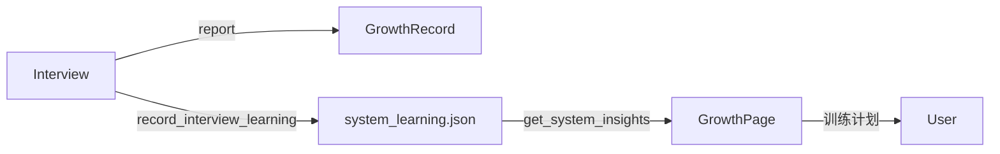

# 成长页面

`src/app/growth/page.tsx` 实现 InterviewOS 的「双重成长」：候选人成长记录 + 系统跨面试学习洞察。

## 关键符号

- `GrowthPage`
- `Section`：分块展示
- `PreviewRow`：预览行

## 数据来源

1. `api.getGrowthHistory()`：最近 20 条 `GrowthRecord`。
2. `api.getSystemInsights()`：系统跨面试聚合洞察。

## 展示内容

### 候选人成长

- 薄弱技能聚合（去重、按出现频次排序）
- 常见错误模式
- 训练计划（合并去重）
- 历史报告入口

### 系统自我成长

- 目标公司/岗位分布
- 历史均分（按公司、按岗位）
- 工具命中统计（GitHub、搜索、公司知识等）
- 有效追问线索
- 近期薄弱点趋势

## 反哺闭环

后端 `InterviewAgent._system_learning_section()` 会在新面试开场时读取系统学习洞察，将历史薄弱点与目标公司均分注入 system prompt。当前已实现记录、展示与注入，**尚未自动改写 prompt 或题库策略**。

## 数据流

## 相关页面

- [后端 API reports 端点](../../backend/api/reports.md)
- [后端成长学习服务](../../backend/services/growth.md)
- [后端 InterviewAgent](../../backend/services/interview/agent.md)
