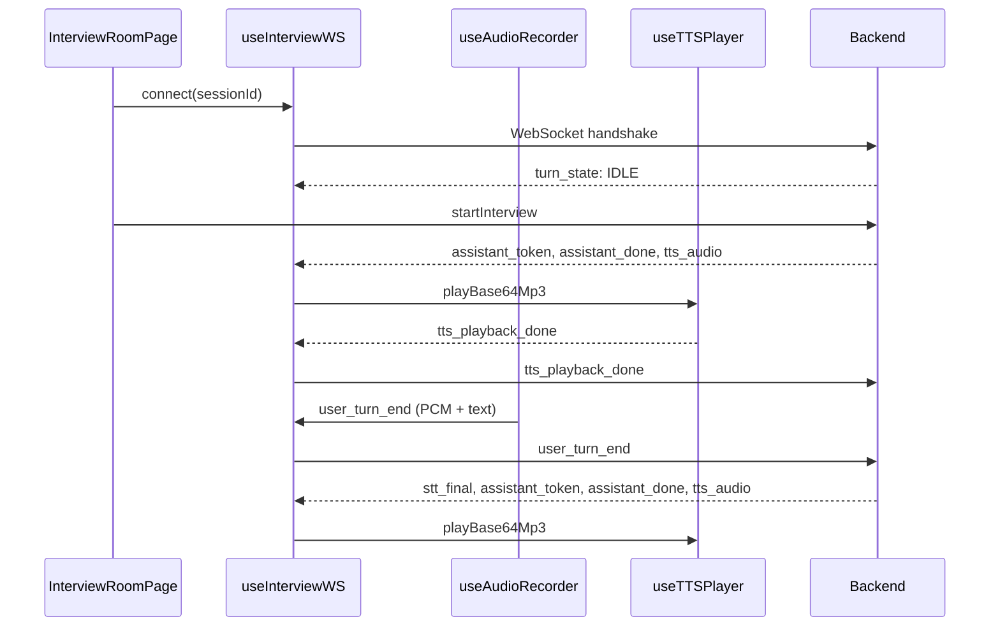

# 实时面试房间

`src/app/interview/[id]/page.tsx` 是 InterviewOS 最核心的实时面试页面。它 orchestrates `useInterviewWS`、`useAudioRecorder`、`useTTSPlayer`、`VideoPanel` 和 `TalkingHeadAvatar`。

## 关键符号

- `InterviewRoomPage`
- `ChatBubble`：聊天气泡
- `normalizeEchoText`：回声文本归一化
- `isLikelyEchoOfAssistant`：判断用户输入是否像 AI 回声

## 页面状态

| 状态 | 说明 |
|---|---|
| 连接中 | WebSocket 尚未建立 |
| 准备面试 | 连接已建立，等待开始 |
| 进行中 | 面试已开始，可语音/文字回答 |
| 播报中 | AI 正在播报 |
| 已完成 | 面试结束，可跳转报告 |
| 错误 | 403/404/连接失败等 |

## 主要交互

- **开始面试**：连接成功后点击开始，调用 `startInterview`（向后端发送或通过 HTTP 触发），接收 `assistant_done` 开场白。
- **语音回答**：
  - 按住/点击麦克风 → `useAudioRecorder` 开始采集。
  - VAD 检测语音结束 → 自动发送 `user_turn_end` 事件（PCM base64 + 可能的浏览器 STT 文本）。
  - 后端 ASR 转写后进入思考与播报。
- **文字回答**：直接输入文本发送 `user_text` 事件。
- **打断播报**：AI 播报时说话/点击按钮，触发 barge-in，停止 TTS 并重新采集。
- **参考提示**：点击「提示」发送 `request_hint`，接收 `reference_hint` 展示。
- **结束面试**：点击「结束」发送 `request_finish`，接收 `interview_complete` 后跳转 `/report/{id}`。

## 数据流

## 聊天展示

- 用户消息：文本或「语音输入」标签。
- AI 消息：`assistant_token` 流式显示，`assistant_done` 后锁定。
- 使用 `StreamingReveal` 与 `MarkdownContent` 渲染。
- 阶段变化 `phase_changed` 时显示阶段提示。

## 视频面板

- `VideoPanel` 展示本地摄像头画面。
- 每 3 秒捕获一帧通过 `vision_update` 发送给后端。
- 用户提交时也会捕获一帧作为多模态输入（`image_base64`）。
- 支持开关摄像头。

## 头像

- 默认使用 `InterviewerAvatar`（CSS/SVG）。
- 如果启用 3D 头像，加载 `TalkingHeadAvatar`；失败回退 2D。
- 头像由 `audioLevel` 驱动唇同步，由 `emotion` 驱动表情。

## 错误处理

- 403/401：显示全屏错误，提示重新创建会话或检查网络。
- 连接断开：自动重连，最多 5 次指数退避，之后进入后台 20 秒重试。
- 麦克风权限拒绝：显示提示并允许切换到文字输入。

## 相关页面

- [媒体管道](../media-pipeline.md)
- [Avatar](../avatar.md)
- [后端实时层](../../backend/realtime/overview.md)
- [后端 InterviewRunner](../../backend/services/interview/runner.md)
- [后端 API interview 端点](../../backend/api/interview.md)
